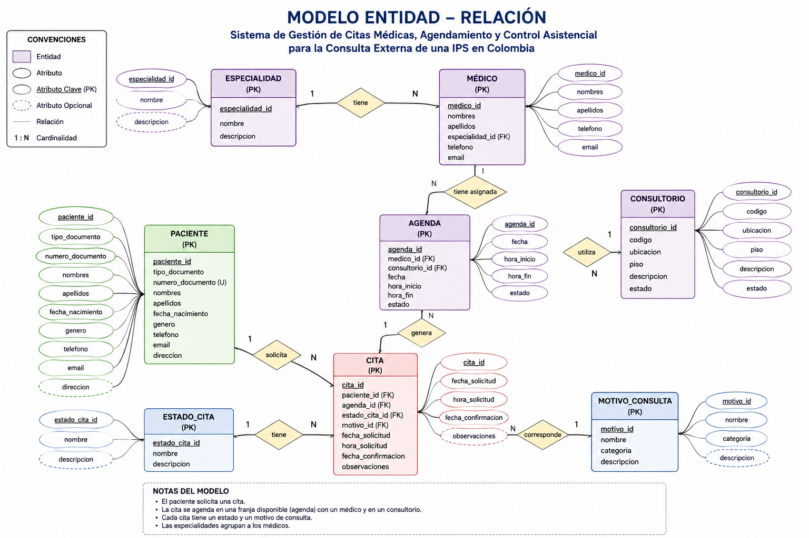

# Sistema de Gestión de Citas Médicas - IPS Colombia

## Sistema de Gestión de Citas Médicas, Agendamiento y Control Asistencial para la Consulta Externa de una IPS en Colombia

### Descripción del proyecto

Este proyecto presenta el diseño e implementación de una base de datos relacional orientada a la gestión de citas médicas, agendas, profesionales, consultorios y control asistencial de la consulta externa de una Institución Prestadora de Servicios de Salud (IPS) en Colombia.

La solución permite integrar la información de pacientes, médicos, especialidades, consultorios, agendas y citas, garantizando la integridad y trazabilidad de la información para apoyar la gestión operativa y el análisis de la demanda asistencial.

---

## Problema identificado

La gestión de la consulta externa presenta retos relacionados con el equilibrio entre oferta y demanda de servicios, disponibilidad de profesionales y consultorios, cancelaciones, inasistencia de pacientes y necesidad de medir oportunamente la asignación de citas.

Una adecuada estructura de información permite identificar estos comportamientos y generar información útil para la toma de decisiones.

---

## Objetivo

Diseñar e implementar una base de datos relacional que permita gestionar el ciclo de vida de las citas médicas de una IPS, integrando pacientes, profesionales, especialidades, consultorios y agendas, y facilitando consultas para el análisis de la operación asistencial.

---

## Modelo Entidad-Relación

El modelo conceptual identifica las entidades principales del sistema, sus atributos, relaciones y cardinalidades.

### Diagrama E/R

El modelo está compuesto por ocho entidades principales:

- Especialidad
- Médico
- Paciente
- Consultorio
- Agenda
- Cita
- Estado de Cita
- Motivo de Consulta

### Principales relaciones

- Una especialidad puede tener varios médicos.
- Un médico puede tener varias agendas.
- Un consultorio puede ser utilizado en diferentes agendas.
- Un paciente puede solicitar varias citas.
- Una agenda puede generar varias citas.
- Un estado de cita puede estar asociado a varias citas.
- Un motivo de consulta puede estar asociado a varias citas.

---

## Estructura de la base de datos

La solución está implementada mediante ocho tablas relacionadas:

| Tabla | Propósito |
|---|---|
| `especialidad` | Catálogo de especialidades médicas |
| `paciente` | Información de los pacientes |
| `medico` | Información de los profesionales |
| `consultorio` | Recursos físicos disponibles |
| `agenda` | Disponibilidad de médicos y consultorios |
| `estado_cita` | Estados posibles de una cita |
| `motivo_consulta` | Motivos y categorías de consulta |
| `cita` | Registro de las solicitudes y citas médicas |

---

## Integridad de los datos

La base de datos implementa:

- Claves primarias (`PRIMARY KEY`)
- Claves foráneas (`FOREIGN KEY`)
- Campos obligatorios (`NOT NULL`)
- Restricciones de unicidad (`UNIQUE`)
- Restricciones de dominio (`CHECK`)
- Integridad referencial entre las entidades

Se realizó una prueba intentando registrar una cita asociada a un paciente inexistente. El sistema rechazó correctamente la operación mediante la restricción de clave foránea.

---

## Datos de prueba

Se cargaron 10 registros en cada una de las ocho tablas principales:

**80 registros en total.**

| Tabla | Registros |
|---|---:|
| Especialidad | 10 |
| Paciente | 10 |
| Médico | 10 |
| Consultorio | 10 |
| Estado_Cita | 10 |
| Motivo_Consulta | 10 |
| Agenda | 10 |
| Cita | 10 |

---

## Operaciones DML

Se realizaron y verificaron las siguientes operaciones:

### UPDATE 1
Actualización del teléfono de un paciente.

### UPDATE 2
Actualización del teléfono de un médico.

### DELETE
Inserción y posterior eliminación controlada de un paciente temporal para demostrar el funcionamiento de `DELETE` sin afectar los registros principales.

---

## Consultas SQL

Se desarrollaron consultas orientadas al análisis de la operación asistencial:

1. Citas por especialidad.
2. Distribución de citas por estado y porcentaje.
3. Tiempo entre solicitud y fecha de cita para medir oportunidad.
4. Análisis de No-Show por especialidad.
5. Demanda por motivo de consulta.
6. Distribución de agendas, médicos y consultorios.
7. Vista ejecutiva de indicadores de la base de datos.

---

## Indicadores obtenidos

La vista ejecutiva de la base de datos permite consultar:

- Número de pacientes.
- Número de médicos.
- Número de especialidades.
- Número de consultorios.
- Número de agendas.
- Número de citas.
- Número de citas con estado No Asistida (No-Show).

En los datos de prueba se obtuvieron:

| Indicador | Resultado |
|---|---:|
| Pacientes | 10 |
| Médicos | 10 |
| Especialidades | 10 |
| Consultorios | 10 |
| Agendas | 10 |
| Citas | 10 |
| No-Show | 1 |

---

## Evidencias de ejecución

Las evidencias del funcionamiento de la base de datos incluyen:

- Creación de las tablas.
- Carga de datos.
- Verificación de 80 registros.
- Operaciones `UPDATE`.
- Operación `DELETE`.
- Consultas SQL.
- Prueba de integridad referencial.
- Vista ejecutiva.

---

## Archivos del proyecto

### Modelo E/R
`02_Modelo_ER/modelo_entidad_relacion.png`

### Script SQL
`03_SQL/sistema_citas_ips.sql`

El script contiene la estructura DDL, restricciones y datos necesarios para reproducir la base de datos.

---

## Tecnologías utilizadas

- MySQL 8.0
- SQL
- GitHub
- db<>fiddle

---

## Demostración ejecutable

La implementación SQL fue probada en un entorno MySQL 8.0 mediante db<>fiddle.

**Enlace público al proyecto ejecutable:**  
https://dbfiddle.uk/C7UvT4D0
---

## Autor

**Ricardo Gutiérrez**
**Angela Uribe**
**Angela Santacruz**

Proyecto académico - Diseño e Implementación de Bases de Datos Relacionales.

**Colombia - 2026**
**Universidad Central**
